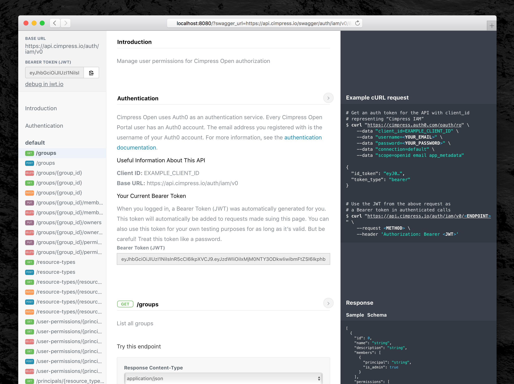

[](https://travis-ci.org/Cimpress-MCP/swagger-ui-cimpress)
[](http://badge.fury.io/js/swagger-ui-cimpress)
[](https://david-dm.org/Cimpress-MCP/swagger-ui-cimpress)
[](https://david-dm.org/Cimpress-MCP/swagger-ui-cimpress#info=devDependencies)

# swagger-ui-cimpress

A swagger-ui fork with an easy to read, responsive three pane view. Used on https://developer.cimpress.io.

Swagger UI uses client-side Javascript (jQuery + Backbone) to download a swagger.json resource and make "Try It" requests to the described endpoints. You can learn more about the swagger-ui project at the upstream source: https://github.com/swagger-api/swagger-ui


## License

Apache-2.0

## Acknowledgement

This is a fork of https://github.com/jensoleg/swagger-ui which is a fork of https://github.com/swagger-api/swagger-ui

## Deploying

### Integration
```yarn && yarn run build && aws s3 sync dist/ s3://mcpportal.cloud.cimpress.io/env-integration/swagger-ui/ && aws cloudfront create-invalidation --distribution-id ET5PYGYWM6FDO --paths "/swagger-ui/*"```

### Staging
```yarn && yarn run build && aws s3 sync dist/ s3://mcpportal.cloud.cimpress.io/env-staging/swagger-ui/ && aws cloudfront create-invalidation --distribution-id E37C234CESFYCV --paths "/swagger-ui/*"```

### Production
```yarn && yarn run build && aws s3 sync dist/ s3://mcpportal.cloud.cimpress.io/env-production/swagger-ui/ && aws cloudfront create-invalidation --distribution-id E3UOOM2P9BY37W --paths "/swagger-ui/*"```